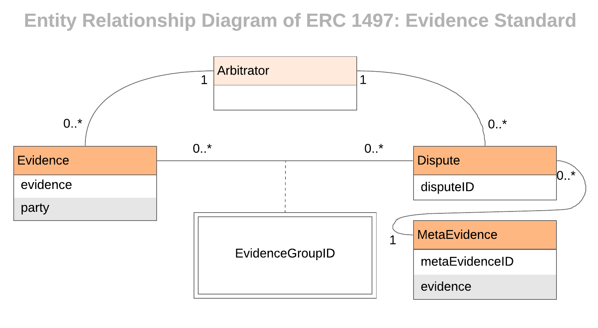

===============================
ERC-1497: Evidence Standard
===============================

.. note:: See the original proposal of the standard `here <https://github.com/ethereum/EIPs/issues/1497>`_.

.. warning::
  Smart contracts in this tutorial are not intended for production but educational purposes. Beware of using them on main network.

In ``SimpleEscrow`` contract, we used a ``string`` to store the agreement between the parties. The deployer could format that ``string`` anyway they like, as
there are many ways to signal the information about the agreement.

Instead, having a standard would allow interoperability. That's why *ERC-1497: Evidence Standard* describes a standard approach for this. It has two categories of information: evidence and meta-evidence.

Evidence, as the name hints, is a piece of information to support a proposition.
Meta-evidence is the information about the dispute itself: the agreement, parties involved, the thing that is to be decided, ruling options etc.

ERC-1497 introduces three new events: MetaEvidence, Evidence and Dispute.

.. literalinclude:: ../contracts/erc-1497/IEvidence.sol
    :language: javascript

* ``event MetaEvidence`` provides the context of the dispute, the question the arbitrators have to answer, the human readable meanings of rulings and specific modes of display for evidence. We use ``_metaEvidenceID`` to uniquely identify a piece of meta-evidence. This is necessary when there are multiple meta-evidence use-cases. ``_evidence`` contains the URI for meta-evidence JSON file.
* ``event Evidence`` links a piece of evidence with an arbitrator, sending party and dispute. ``_evidence`` contains the URI for evidence JSON file.
* ``event Dispute``  is raised when a dispute is created to link the proper meta-evidence and evidence group to the dispute. The event includes a reference to the arbitrator, a unique identifier for the dispute itself, the identifier to look up the meta-evidence event log and the identifier of the evidence group that can be used to look up all evidence submitted in the grouping.

.. note:: See the `original proposal <https://github.com/ethereum/EIPs/issues/1497>`_ for standard evidence and meta-evidence JSON formats.

Let's return to ``SimpleEscrow`` and refactor it to implement ERC-1497 interface. Recall ``SimpleEscrow``:

.. literalinclude:: ../contracts/examples/SimpleEscrow.sol
    :language: javascript

Now, first let's implement `IEvidence`:

.. code-block:: javascript
  :emphasize-lines: 5,7

  pragma solidity ^0.5;

  import "../IArbitrable.sol";
  import "../Arbitrator.sol";
  import "../erc-1497/IEvidence.sol";

  contract SimpleEscrowWithERC1497 is IArbitrable, IEvidence {
      address payable public payer = msg.sender;
      address payable public payee;
      uint public value;
      Arbitrator public arbitrator;
      string public agreement;
      uint public createdAt;
      uint constant public reclamationPeriod = 3 minutes;
      uint constant public arbitrationFeeDepositPeriod = 3 minutes;

      enum Status {Initial, Reclaimed, Disputed, Resolved}
      Status public status;

      uint public reclaimedAt;

      enum RulingOptions {PayerWins, PayeeWins, Count}

      constructor(address payable _payee, Arbitrator _arbitrator, string memory _agreement) payable {
          value = msg.value;
          payee = _payee;
          arbitrator = _arbitrator;
          agreement = _agreement;
          createdAt = block.timestamp;
      }

      function releaseFunds() public {
        require(status == Status.Initial, "Transaction is not in initial status.");

        if(msg.sender != payer)
            require(block.timestamp - createdAt > reclamationPeriod, "Payer still has time to reclaim.");

        status = Status.Resolved;
        payee.send(value);
      }

      function reclaimFunds() public payable {
          require(status == Status.Initial || status == Status.Reclaimed, "Status should be initial or reclaimed.");
          require(msg.sender == payer, "Only the payer can reclaim the funds.");

          if(status == Status.Reclaimed){
              require(block.timestamp - reclaimedAt > arbitrationFeeDepositPeriod, "Payee still has time to deposit arbitration fee.");
              payer.send(address(this).balance);
              status = Status.Resolved;
          }
          else{
            require(block.timestamp - createdAt < reclamationPeriod, "Reclamation period ended.");
            require(msg.value == arbitrator.arbitrationCost(""), "Can't reclaim funds without depositing arbitration fee.");
            reclaimedAt = block.timestamp;
            status = Status.Reclaimed;
          }
      }

      function depositArbitrationFeeForPayee() public payable {
          require(status == Status.Reclaimed, "Payer didn't reclaim, nothing to dispute.");
          arbitrator.createDispute{value: msg.value}(uint(RulingOptions.Count), "");
          status = Status.Disputed;
      }

      function rule(uint _disputeID, uint _ruling) public {
          require(msg.sender == address(arbitrator), "Only the arbitrator can execute this.");
          require(status == Status.Disputed, "There should be dispute to execute a ruling.");
          status = Status.Resolved;
          if(_ruling == uint(RulingOptions.PayerWins)) payer.send(address(this).balance);
          else payee.send(address(this).balance);
          emit Ruling(arbitrator, _disputeID, _ruling);
      }

      function remainingTimeToReclaim() public view returns (uint) {
          if(status != Status.Initial) revert("Transaction is not in initial state.");
          return (createdAt + reclamationPeriod - block.timestamp) > reclamationPeriod ? 0 : (createdAt + reclamationPeriod - block.timestamp);
      }

      function remainingTimeToDepositArbitrationFee() public view returns (uint) {
          if (status != Status.Reclaimed) revert("Funds are not reclaimed.");
          return (reclaimedAt + arbitrationFeeDepositPeriod - block.timestamp) > arbitrationFeeDepositPeriod ? 0 : (reclaimedAt + arbitrationFeeDepositPeriod - block.timestamp);
      }
  }

And then, we will get rid of ``string agreement``.  Instead we need ``uint metaevidenceID``, ``string _metaevidence`` that contains the URI to metaevidence JSON that is formatted according to the standard and we have to emit ``MetaEvidence`` event.

.. literalinclude:: ../contracts/examples/SimpleEscrowWithERC1497.sol
    :language: javascript
    :lines: 1-24,26-65,67-86
    :emphasize-lines: 24,26,32

We set the identifier of meta-evidence to constant zero, as there won't be multiple meta-evidence for this contract. Any constant number would do the job. Then we emit ``MetaEvidence`` with the provided
``_metaevidence``. This string contains the URI from where the content of meta-evidence can be fetched.

Also, we need to emit ``Dispute`` when we create a new dispute:

.. literalinclude:: ../contracts/examples/SimpleEscrowWithERC1497.sol
    :language: javascript
    :lines: 1-86
    :emphasize-lines: 25,67

There will be only one dispute in this contract so we can use a constant zero for ``evidenceGroupID``.

Lastly, we need a function to let parties submit evidence:

.. literalinclude:: ../contracts/examples/SimpleEscrowWithERC1497.sol
    :language: javascript
    :emphasize-lines: 90-95

Congratulations, now your arbitrable is ERC-1497 compatible!
