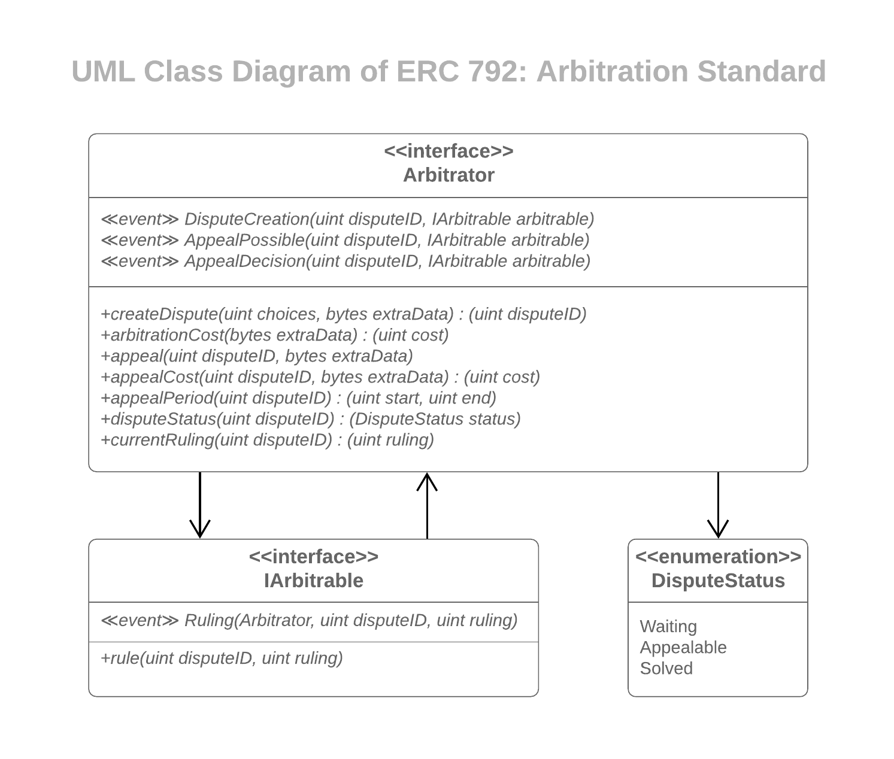

===============
Introduction
===============

.. note::
  This tutorial requires basic Solidity programming skills.

.. note:: See the original proposal of the standard `here <https://github.com/ethereum/EIPs/issues/792>`_.

ERC-792: Arbitration Standard proposes a standard for arbitration on Ethereum. The standard has two types of smart contracts: ``Arbitrable`` and ``Arbitrator``.

``Arbitrable`` contracts are the contracts on which *rulings* of the authorized ``Arbitrator`` are enforceable.

``Arbitrator`` contracts are the contracts which give *rulings* on disputes.

In other words, ``Arbitrator`` gives rulings, and ``Arbitrable`` enforces them.

In the following topics, you will be guided through the usage of the standard. We will implement some examples for ``Arbitrable`` and ``Arbitrator`` contracts.

.. note::
  Highlighted sections in source code examples indicate statements that are just modified.

.. note::
  You can find the `contracts used in this tutorial here <https://github.com/kleros/erc-792/tree/master/contracts>`_.

We will also implement a very simple decentralized application on top of an ``Arbitrable`` we developed. You can see the `live demo of the DAPP we will develop, here <https://simple-escrow.netlify.com/>`_.
